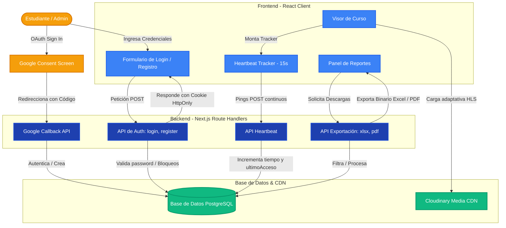

# Documentación Técnica de la Arquitectura de SaberHub

Esta documentación detalla el diseño arquitectónico, los estándares de seguridad, el sistema de tracking de tiempo y la lógica de exportación analítica implementada en **SaberHub**.

---

## 1. Diagrama de la Arquitectura del Sistema

El siguiente diagrama visualiza el flujo completo de autenticación de un usuario, la interacción con las lecciones protegidas, el disparo asíncrono del tracker de tiempo de conexión (_Heartbeat_), y el motor de generación de reportes en Excel y PDF.

---

## 2. Subsistema de Autenticación y Seguridad Custom JWT

El sistema prescinde de proveedores pesados externos y opta por una infraestructura de firmas basada en **JSON Web Tokens (JWT)** ligera y segura, combinada con un esquema de fuerza bruta a nivel de base de datos.

### A. Políticas de Complejidad de Contraseña

Tanto en el frontend como en el backend, las contraseñas deben cumplir obligatoriamente:

- Mínimo 8 caracteres de longitud.
- Al menos una letra mayúscula (`[A-Z]`).
- Al menos una letra minúscula (`[a-z]`).
- Al menos un dígito numérico (`\d`).

### B. Bloqueo Temporal por Fuerza Bruta

- **Detección**: Cada fallo de contraseña incrementa el contador `intentosFallidos` en el modelo `Usuario`.
- **Disparo**: Al llegar al **5to intento consecutivo fallido**, la cuenta es bloqueada de forma automatizada por **15 minutos** asignando la fecha de desbloqueo en `bloqueadoHasta`.
- **Desbloqueo**: Al expirar los 15 minutos, el sistema permite de nuevo ingresar credenciales. Si el login es exitoso o se completa un flujo de recuperación de contraseña, el contador y la fecha de bloqueo son reseteados a `0` y `null` respectivamente.

### C. Recuperación y Verificación Unidireccional

- **Email Verification**: Al registrarse, el usuario inicia con `verificado = false`. Se genera un token aleatorio criptográficamente fuerte (`crypto`) y se almacena en `VerificationToken` con validez de **24 horas**. Al ingresar al enlace, se activa su cuenta.
- **Password Reset**: Si el usuario olvida su contraseña, se genera un token en `PasswordResetToken` con validez exacta de **1 hora** y de un solo uso (_one-time token_). Al ser canjeado con éxito, el token se quema y se actualizan las credenciales con encriptación `bcrypt`.

---

## 3. Rastreador de Conexión Activa (Heartbeat)

Para garantizar un cálculo preciso del tiempo de conexión por sesión sin saturar las conexiones de base de datos ni requerir conexiones de WebSocket activas, se diseñó un modelo de **Heartbeat (Pulso de Conexión)**:

1. **Montaje del Tracker**: Al ingresar al visor del curso, se activa un componente de React invisible que inicia un temporizador de `15 segundos`.
2. **Ciclo de Ping**: Cada 15 segundos se envía un pulso `POST` asíncrono a `/api/progreso/heartbeat` conteniendo el `cursoId`.
3. **Persistencia Atómica**: El backend incrementa de forma segura en `15` el entero `tiempoConectado` en la tabla `Inscripcion` (representando segundos acumulados) y actualiza el campo `ultimoAcceso` a la hora actual.
4. **Desmontaje**: Si el usuario cierra el reproductor, se desloguea, o navega a otra pestaña, el temporizador se destruye, deteniendo la acumulación de tiempo.

---

## 4. Motor de Reportes y Descargas

El motor de exportación estructurado en `/api/reportes/exportar/route.js` centraliza las consultas y optimiza la memoria procesando las exportaciones de forma binaria.

### A. Filtros Analíticos Soportados

Los reportes se pueden segmentar y cruzar por:

- **Curso** (ID de Curso).
- **Grupo** (Filtra los miembros de dicho grupo inscritos en el curso).
- **Rango de Fechas** (Fechas de inscripción entre `fechaInicio` y `fechaFin`).
- **Alumno específico** (Filtro por ID o coincidencia en buscador cliente).

### B. Formatos Binarios

1. **Microsoft Excel (.xlsx)**:
   - Construido de forma modular mediante `xlsx` (SheetJS).
   - Escribe encabezados estructurados y filas de datos formateados.
   - Autoajusta el ancho de cada columna de forma adaptativa midiendo la longitud del contenido para garantizar perfecta lectura.
   - Retorna como un flujo de buffer binario con cabecera `application/vnd.openxmlformats-officedocument.spreadsheetml.sheet`.
2. **Documento PDF (.pdf)**:
   - Dibujado desde cero usando la biblioteca `pdf-lib`.
   - Incluye un banner corporativo superior SaberHub con código hexadecimal institucional.
   - Dibuja una grilla con estilos cebra para filas de alumnos pares e impares, facilitando la legibilidad.
   - Cuenta con un **algoritmo de paginación de altura física** que calcula el límite del papel carta (Letter) y añade automáticamente nuevas páginas dibujando los encabezados correspondientes si el volumen de alumnos excede la página actual.
