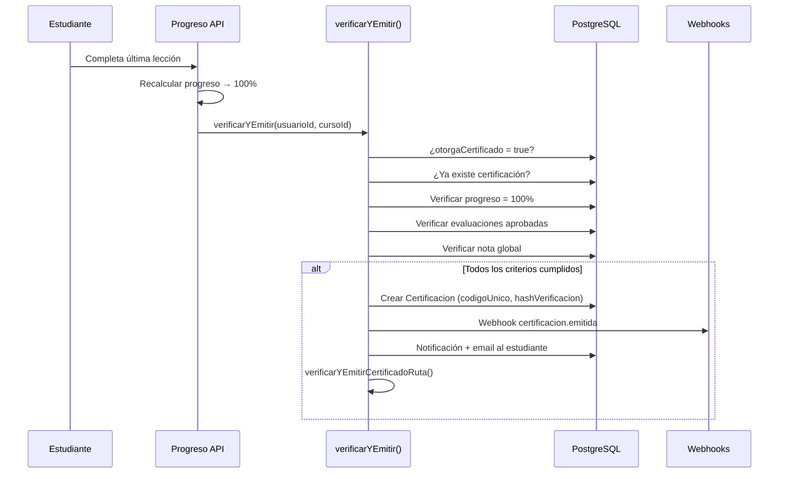

## Certificados

SaberHub emite **certificados de finalización** automáticamente cuando un estudiante cumple todos los criterios definidos por el instructor.

### Criterios de Emisión

La función `verificarYEmitir()` evalúa **3 criterios** configurables por curso:

| Criterio | Campo en BD | Descripción |
|---|---|---|
| ✅ **Progreso de lecciones** | Siempre requerido | El estudiante debe completar el **100%** de las lecciones |
| 📝 **Evaluaciones aprobadas** | `criterioEvalAprobadas` | Debe aprobar **todas** las evaluaciones del curso (puntaje ≥ `puntajeMinimo`) |
| 📊 **Nota global mínima** | `criterioNotaGlobal` | El promedio de los mejores intentos por evaluación debe superar el umbral |

### Flujo de Emisión



### Estructura del Certificado

| Campo | Descripción |
|---|---|
| `codigoUnico` | Código alfanumérico de 16 caracteres (UUID sin guiones, uppercase) |
| `hashVerificacion` | SHA-256 de `inscripcionId + codigoUnico` |
| `urlPdf` | Ruta para generar/descargar el PDF: `/api/certificados/pdf/[codigo]` |
| `estado` | `emitido` o `revocado` |
| `fechaEmision` | Timestamp de generación automática |

### Endpoints de Certificados

| Método | Endpoint | Descripción |
|---|---|---|
| `GET` | `/api/certificados` | Listar mis certificados (estudiante) o todos (admin) |
| `GET` | `/api/certificados/pdf/[codigo]` | Descargar PDF del certificado de curso |
| `GET` | `/api/certificados/ruta-pdf/[codigo]` | Descargar PDF del certificado de ruta |
| `GET` | `/api/certificados/verificar/[codigo]` | Verificación pública de autenticidad |
| `PUT` | `/api/certificados/[id]/revocar` | Revocar un certificado (admin) |

### Verificación Pública

Cualquier persona puede verificar la autenticidad de un certificado con el código único:

```
GET /api/certificados/verificar/A1B2C3D4E5F6G7H8
```

Retorna los datos del certificado, el estudiante, el curso y la fecha de emisión, **sin requerir autenticación**.

---

## Certificados de Ruta de Formación

Cuando un estudiante completa **todos los cursos** de una Ruta de Formación, el sistema emite automáticamente un certificado especial de ruta:

1. Al emitir un certificado de curso, se verifica si el curso pertenece a alguna ruta.
2. Se obtienen todos los cursos de la ruta.
3. Se verifica que el estudiante tenga certificación individual de **cada uno**.
4. Si completó todos → se emite `CertificadoRuta` con su propio `codigoUnico`.

---

## Reportes y Exportación

### Endpoint de exportación

```
GET /api/reportes/exportar?cursoId=xxx&format=excel|pdf|json
```

### Filtros disponibles

| Parámetro | Descripción |
|---|---|
| `cursoId` | **(Requerido)** ID del curso a reportar |
| `grupoId` | Filtrar por miembros de un grupo específico |
| `fechaInicio` | Fecha mínima de inscripción |
| `fechaFin` | Fecha máxima de inscripción |
| `usuarioId` | Filtrar un alumno específico |
| `format` | `excel` (default), `pdf`, o `json` |

### Datos incluidos en el reporte

Para cada alumno inscrito, el reporte calcula y muestra:

| Columna | Fuente |
|---|---|
| Documento | `usuario.documento` |
| Nombre | `usuario.nombre` |
| Correo | `usuario.email` |
| Estado Inscripción | `inscripcion.estado` |
| Progreso (%) | `inscripcion.progreso` |
| Nota Promedio (%) | Promedio de las mejores notas por evaluación |
| Tiempo Conectado | `inscripcion.tiempoConectado` formateado (Xh Xm Xs) |
| Último Acceso | `inscripcion.ultimoAcceso` |
| Fecha de Inscripción | `inscripcion.fechaInscripcion` |

### Formato Excel (.xlsx)

Generado con la librería `xlsx` (SheetJS):

- Hojas de cálculo tabuladas con encabezados
- **Autoajuste de ancho de columnas** midiendo la longitud del contenido
- Content-Type: `application/vnd.openxmlformats-officedocument.spreadsheetml.sheet`

### Formato PDF

Dibujado desde cero con `pdf-lib`:

- **Banner corporativo** azul SaberHub (`#1E40AF`) con título del reporte y curso
- Subtítulo con fecha del reporte y total de alumnos
- **Tabla con contraste cebra** (filas alternas en gris claro)
- Estados con **colores semánticos**: verde (activo), azul (finalizado), rojo (retirado), gris (inactivo)
- **Paginación automática**: si los datos exceden la altura de la página (Letter 8.5"×11"), se crean nuevas páginas con encabezados repetidos
- Líneas divisorias sutiles entre filas

### Formato JSON

Retorna los datos crudos para procesamiento programático:

```json
{
  "success": true,
  "data": [
    {
      "documento": "1234567890",
      "nombre": "Juan Pérez",
      "email": "juan@example.com",
      "estado": "activo",
      "progreso": 85,
      "calificacionPromedio": 92,
      "tiempoConectado": "2h 15m 30s",
      "ultimoAcceso": "24/5/2026, 3:45:00 p. m.",
      "fechaInscripcion": "1/3/2026, 10:00:00 a. m."
    }
  ]
}
```

:::note[Permisos]
Solo los usuarios con rol `admin` o `instructor` pueden exportar reportes. Los instructores solo pueden exportar reportes de **sus propios cursos**.
:::
