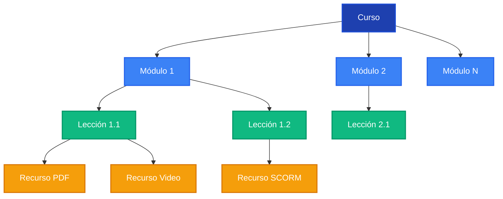

SaberHub organiza el contenido educativo en una jerarquía de **Curso → Módulos → Lecciones → Recursos**, con soporte para contenido multimedia, videos HLS adaptativos y paquetes SCORM.

## Jerarquía de Contenido



---

## API de Cursos

### Endpoints principales

| Método | Endpoint | Descripción | Roles |
|---|---|---|---|
| `POST` | `/api/cursos` | Crear un curso nuevo | Instructor, Admin |
| `GET` | `/api/cursos` | Listar mis cursos (instructor) | Instructor |
| `GET` | `/api/cursos/catalogo` | Catálogo público de cursos | Público |
| `GET` | `/api/cursos/[id]` | Detalle de un curso | Autenticado |
| `PUT` | `/api/cursos/[id]` | Actualizar un curso | Instructor dueño |
| `DELETE` | `/api/cursos/[id]` | Eliminar un curso | Instructor dueño, Admin |
| `GET` | `/api/cursos/[id]/contenido` | Módulos + lecciones del curso | Inscrito |
| `GET` | `/api/cursos/externos` | Listado de cursos externos (scraping) | Autenticado |

### Crear un curso (`POST /api/cursos`)

```json
{
  "titulo": "Introducción a la Programación",
  "descripcion": "Aprende los fundamentos...",
  "categoriaId": "clxx...",
  "institucionId": "clxx...",
  "nivel": "básico",
  "otorgaCertificado": true,
  "criterioLeccionesMin": 100,
  "criterioEvalAprobadas": true,
  "criterioNotaGlobal": 70
}
```

### Estados del Curso

| Estado | Descripción |
|---|---|
| `borrador` | Solo visible para el instructor creador. No aparece en el catálogo. |
| `publicado` | Visible en el catálogo público. Los estudiantes pueden inscribirse. |
| `archivado` | Oculto del catálogo. Inscripciones existentes se mantienen. |

---

## Módulos y Lecciones

Los módulos y lecciones se gestionan dentro de la ruta `/api/cursos/[id]/contenido`:

- **Módulos** tienen un `orden` numérico (unique por curso) y un estado (`activo` / `oculto`).
- **Lecciones** tienen `contenidoTexto` (HTML/Markdown), `urlVideo` (HLS de Cloudinary) y `duracion` en minutos.
- Las lecciones pueden marcarse como `esPreview = true` para acceso sin inscripción.
- Soporte para **reordenamiento Drag & Drop** usando `@dnd-kit` en el frontend.

### Tipos de Recurso por Lección

| Tipo | Descripción |
|---|---|
| `pdf` | Documentos PDF adjuntos |
| `video` | Videos subidos a Cloudinary (HLS adaptativo) |
| `audio` | Archivos de audio |
| `imagen` | Imágenes ilustrativas |
| `presentacion` | Slides o presentaciones |
| `enlace` | Links externos |
| `otro` | Cualquier otro formato |

---

## Soporte SCORM

SaberHub soporta paquetes SCORM para integrar contenido e-learning estándar:

1. **Subida**: `POST /api/upload/scorm` — Sube un archivo `.zip` SCORM.
2. **Extracción**: El paquete se descomprime con `adm-zip` y se sube a Cloudinary.
3. **Marcado**: La lección se marca con `esScorm = true` y `scormUrl` apunta al `index.html` del paquete.
4. **Visor**: La ruta `/scorm` embebe el contenido SCORM en un iframe.
5. **Progreso**: `POST /api/progreso/scorm` registra el avance del estudiante dentro del paquete.

---

## Inscripciones

| Método | Endpoint | Descripción |
|---|---|---|
| `POST` | `/api/inscripciones` | Inscribir al usuario autenticado en un curso |
| `GET` | `/api/inscripciones` | Listar mis inscripciones activas |
| `PUT` | `/api/inscripciones/[id]` | Actualizar estado de inscripción |
| `POST` | `/api/inscripciones/importar` | Importar inscripciones desde Excel |
| `POST` | `/api/inscripciones/masiva-nuevos` | Inscripción masiva creando usuarios |

### Estados de Inscripción

| Estado | Descripción |
|---|---|
| `activo` | El estudiante tiene acceso completo al curso |
| `inactivo` | Acceso pausado temporalmente |
| `finalizado` | Completó el curso satisfactoriamente |
| `retirado` | Se retiró del curso |

---

## Progreso y Tracking

### Heartbeat de conexión

Un tracker invisible en el visor de curso envía pings cada 15 segundos:

```
Cada 15s → POST /api/progreso/heartbeat { cursoId }
         → inscripcion.tiempoConectado += 15
         → inscripcion.ultimoAcceso = now()
```

### Completar lección

```
POST /api/progreso/leccion { leccionId }
  → ProgresoLeccion.completada = true
  → Recalcula % progreso de inscripción
  → Si progreso = 100% → verificar criterios de certificación
```

### Progreso del curso

| Endpoint | Descripción |
|---|---|
| `GET /api/progreso/curso/[cursoId]` | Progreso individual del estudiante |
| `GET /api/progreso/grupo/[cursoId]` | Progreso de todos los miembros de un grupo |
| `POST /api/progreso/heartbeat` | Registrar tiempo de conexión |
| `POST /api/progreso/leccion` | Marcar lección como completada |
| `POST /api/progreso/scorm` | Registrar progreso SCORM |

---

## Catálogo Público

El endpoint `GET /api/cursos/catalogo` retorna cursos con estado `publicado` y soporta:

- Filtrado por **categoría** e **institución**
- Búsqueda por **título** (parcial, case-insensitive)
- Paginación
- Información del instructor y conteo de inscripciones

---

## Prerrequisitos de Curso

Los administradores pueden definir que un curso requiera completar otro curso antes:

```
POST /api/admin/cursos/prerrequisitos
{ cursoId, prerequisitoId }
```

El sistema verifica automáticamente que el estudiante tenga certificación del curso prerrequisito antes de permitir la inscripción.
