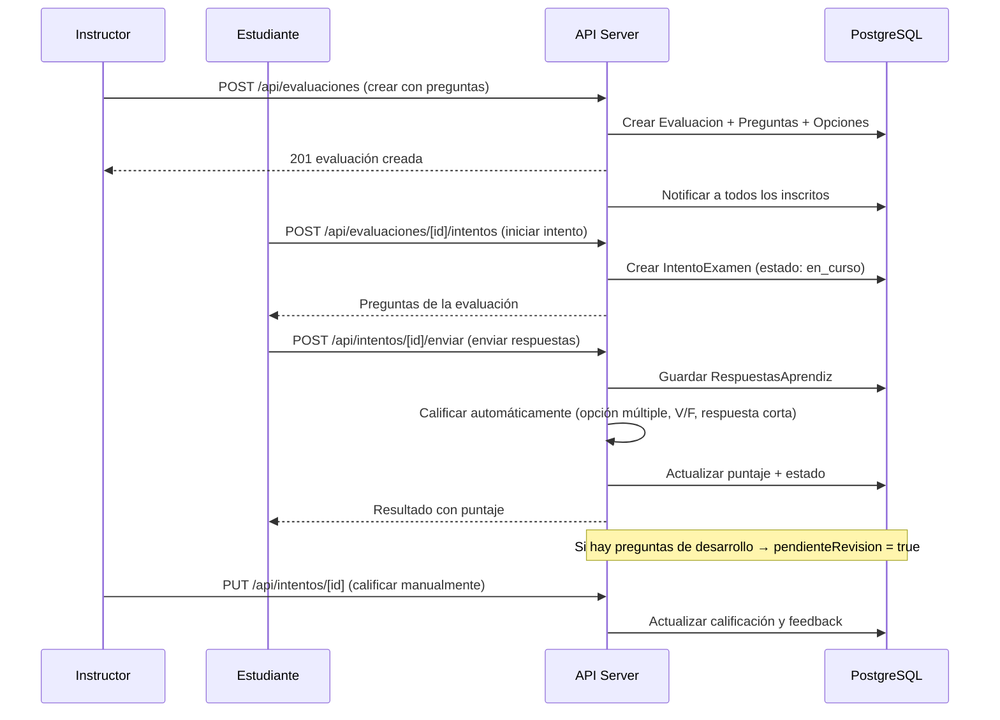

SaberHub incluye un motor de evaluaciones completo que soporta **4 tipos de pregunta**, un **banco de preguntas reutilizable** y flujo de calificación automática y manual.

## Flujo Completo de Evaluación



---

## Tipos de Pregunta

| Tipo | ID en BD | Calificación | Descripción |
|---|---|---|---|
| **Opción múltiple** | `opcion_multiple` | ✅ Automática | Una o más opciones correctas marcadas como `esCorrecta` |
| **Verdadero/Falso** | `verdadero_falso` | ✅ Automática | Dos opciones: verdadero y falso |
| **Respuesta corta** | `respuesta_corta` | ✅ Automática | Comparación exacta o por regex con `respuestaCorrecta` / `patronRegex` |
| **Desarrollo** | `desarrollo` | ❌ Manual | El instructor califica manualmente con `pendienteRevision = true` |

---

## Endpoints de Evaluaciones

| Método | Endpoint | Descripción |
|---|---|---|
| `GET` | `/api/evaluaciones?cursoId=xxx` | Listar evaluaciones de un curso |
| `GET` | `/api/evaluaciones?pendientes=true` | Evaluaciones pendientes (estudiante) |
| `POST` | `/api/evaluaciones` | Crear evaluación con preguntas |
| `GET` | `/api/evaluaciones/[id]` | Detalle de una evaluación |
| `PUT` | `/api/evaluaciones/[id]` | Editar evaluación |
| `DELETE` | `/api/evaluaciones/[id]` | Eliminar evaluación |
| `POST` | `/api/evaluaciones/[id]/intentos` | Iniciar un intento de examen |
| `GET` | `/api/intentos/[intentoId]` | Ver detalle de un intento |
| `POST` | `/api/intentos/[intentoId]/enviar` | Enviar respuestas del examen |

### Crear evaluación (`POST /api/evaluaciones`)

```json
{
  "titulo": "Examen Final - Módulo 3",
  "descripcion": "Evaluación sumativa del módulo",
  "cursoId": "clxx...",
  "moduloId": "clxx...",
  "puntajeMinimo": 70,
  "duracionMinutos": 60,
  "intentosMaximos": 3,
  "ordenAleatorio": true,
  "mostrarRespuestas": false,
  "preguntas": [
    {
      "pregunta": "¿Cuál es el lenguaje principal de Next.js?",
      "tipo": "opcion_multiple",
      "puntos": 2,
      "opciones": [
        { "textoOpcion": "Python", "esCorrecta": false },
        { "textoOpcion": "JavaScript", "esCorrecta": true },
        { "textoOpcion": "Ruby", "esCorrecta": false }
      ]
    },
    {
      "pregunta": "Next.js es un framework de React",
      "tipo": "verdadero_falso",
      "puntos": 1,
      "opciones": [
        { "textoOpcion": "Verdadero", "esCorrecta": true },
        { "textoOpcion": "Falso", "esCorrecta": false }
      ]
    },
    {
      "pregunta": "¿Qué comando inicia el servidor de desarrollo?",
      "tipo": "respuesta_corta",
      "puntos": 1,
      "respuestaCorrecta": "npm run dev",
      "patronRegex": "^(npm|pnpm|yarn)\\s+run\\s+dev$"
    },
    {
      "pregunta": "Explica las ventajas del Server-Side Rendering",
      "tipo": "desarrollo",
      "puntos": 5
    }
  ]
}
```

---

## Configuración de Evaluación

| Campo | Tipo | Default | Descripción |
|---|---|---|---|
| `puntajeMinimo` | `Int` | `70` | Puntaje mínimo para aprobar (%) |
| `duracionMinutos` | `Int?` | `null` | Tiempo límite. Si es null, no tiene límite |
| `intentosMaximos` | `Int` | `1` | Número máximo de intentos permitidos |
| `ordenAleatorio` | `Boolean` | `false` | Mezclar el orden de las preguntas |
| `mostrarRespuestas` | `Boolean` | `false` | Mostrar respuestas correctas al finalizar |

---

## Estados de un Intento

| Estado | Descripción |
|---|---|
| `en_curso` | El estudiante está respondiendo activamente |
| `finalizado` | Enviado y calificado automáticamente |
| `expirado` | Superó el tiempo límite sin enviar |
| `calificado` | Calificado manualmente por el instructor (preguntas de desarrollo) |

---

## Banco de Preguntas

El banco de preguntas permite a los instructores **reutilizar preguntas** entre evaluaciones:

| Método | Endpoint | Descripción |
|---|---|---|
| `GET` | `/api/banco` | Listar mis preguntas del banco |
| `POST` | `/api/banco` | Crear pregunta en el banco |
| `PUT` | `/api/banco/[id]` | Editar pregunta del banco |
| `DELETE` | `/api/banco/[id]` | Eliminar pregunta del banco |
| `GET` | `/api/banco/categorias` | Listar categorías del banco |
| `POST` | `/api/banco/categorias` | Crear categoría |
| `POST` | `/api/banco/importar` | Importar preguntas masivamente |

### Estructura del banco

```
Instructor
  └── CategoriaBanco ("Matemáticas", "Historia", ...)
       └── PreguntaBanco
            ├── pregunta: "¿Cuánto es 2+2?"
            ├── tipo: opcion_multiple
            ├── puntos: 1
            └── OpcionBanco[]
                 ├── "3" (esCorrecta: false)
                 ├── "4" (esCorrecta: true)
                 └── "5" (esCorrecta: false)
```

:::tip[Importación masiva]
El endpoint `POST /api/banco/importar` permite importar preguntas en lote, ideal para migrar desde otras plataformas LMS.
:::

---

## Notificaciones Automáticas

Cuando se crea una evaluación, el sistema notifica **automáticamente** a todos los estudiantes inscritos activos en el curso:

- **In-app**: Notificación en el centro de notificaciones con enlace al curso.
- **Email**: Si el estudiante tiene habilitada la preferencia `prefEmailEvaluacion`.
- **Contenido**: `Nueva evaluación disponible: [título] 📝`
