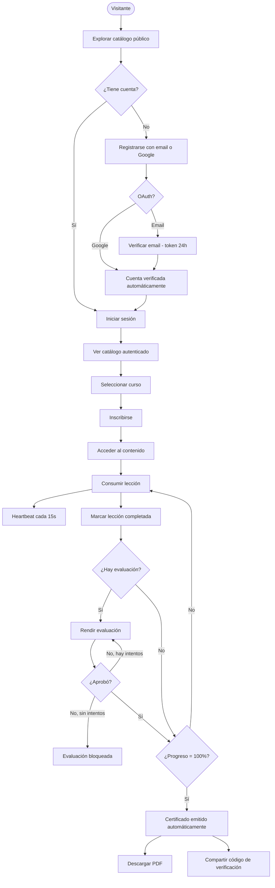
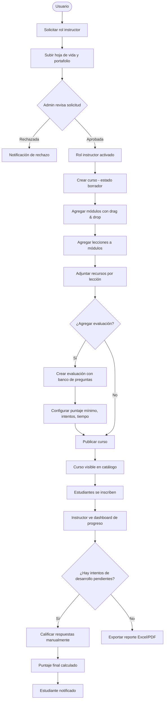
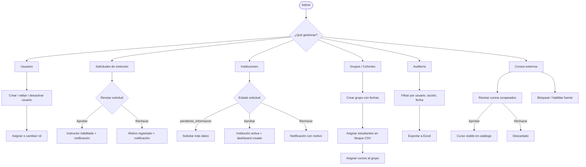
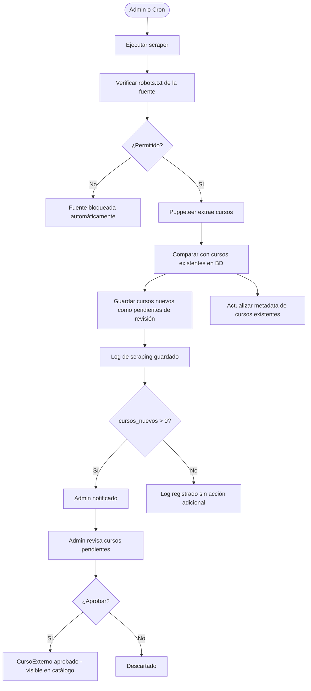
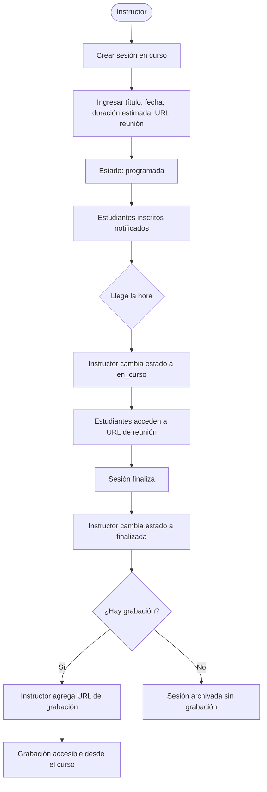
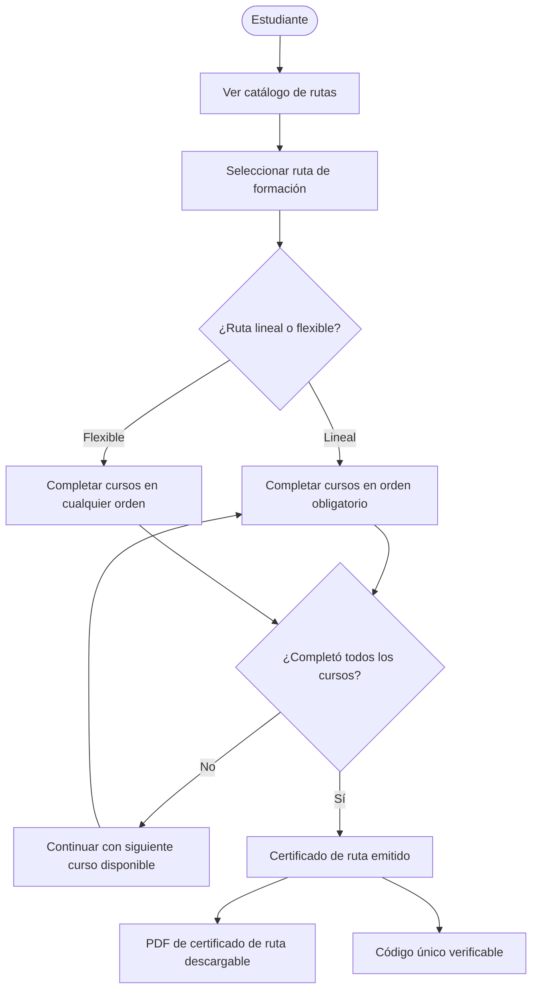

## Flujo del Alumno

Desde el registro hasta la obtención del certificado.

---

## Flujo del Instructor

Desde la solicitud de rol hasta la calificación de evaluaciones.

---

## Flujo del Administrador

Gestión de usuarios, instituciones y solicitudes.

---

## Flujo de Cursos Externos (Scraping)

Desde la ejecución del scraper hasta la publicación del curso.

---

## Flujo de Videoconferencia

Programación y ejecución de sesión en vivo.

---

## Flujo de Ruta de Formación

Inscripción y certificación de ruta completa.

