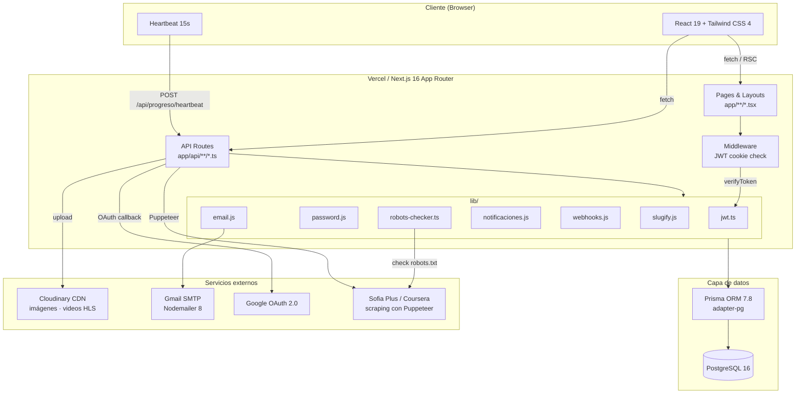
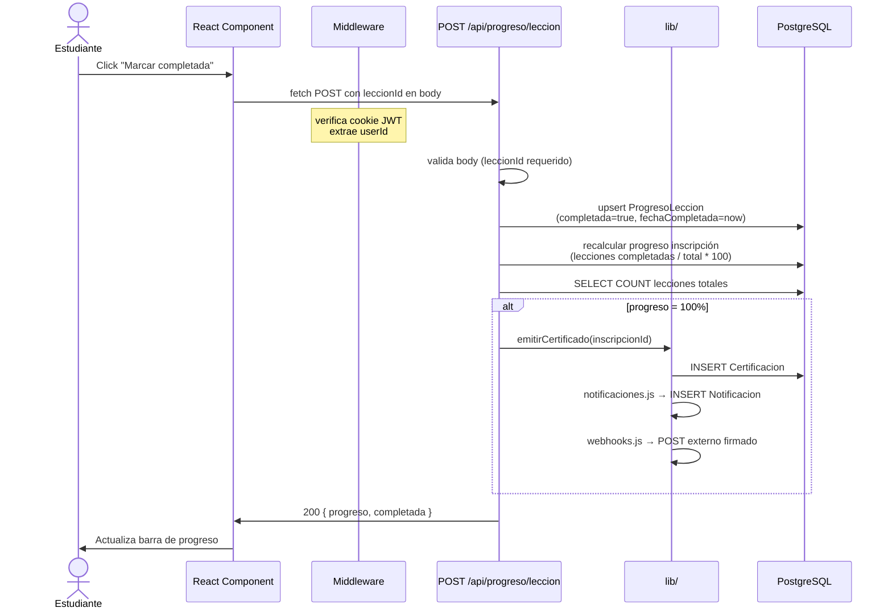

## Diagrama de arquitectura general



---

## Componentes del sistema

| Componente | Tecnología | Responsabilidad |
|---|---|---|
| **App Router** | Next.js 16 | Enrutamiento, layouts, Server Components, middleware |
| **API Routes** | Next.js Route Handlers | 78 endpoints REST organizados por dominio |
| **Middleware** | Next.js Middleware | Verificación de JWT en cookie antes de renderizar rutas protegidas |
| **ORM** | Prisma 7.8 + adapter-pg | Acceso tipado a BD; 47 modelos; sin SQL manual |
| **Base de datos** | PostgreSQL 16 | Persistencia principal; ACID; relaciones complejas |
| **Autenticación** | jose 6 + bcryptjs 3 | JWT HS256 en HttpOnly cookie; hash de contraseñas |
| **Almacenamiento** | Cloudinary 2 | CDN para imágenes, videos HLS y archivos de grupos |
| **Email** | Nodemailer 8 + SMTP Gmail | Verificación, recuperación de contraseña, notificaciones, alertas |
| **OAuth** | Google OAuth 2.0 | SSO; auto-registro de estudiantes |
| **Scraper** | Puppeteer 24 + robots-parser 3 | Extracción de cursos externos con cumplimiento de robots.txt |
| **PDF** | pdf-lib 1.17 | Generación de certificados sin dependencias nativas |
| **Excel** | SheetJS (xlsx) 0.18 | Exportación de reportes de progreso y calificaciones |
| **SCORM** | adm-zip 0.5 | Extracción de paquetes SCORM; tracking CMI en `ProgresoScorm` |
| **Webhooks** | crypto (Node.js) | Despacho de eventos firmados con HMAC-SHA256 |

---

## Decisiones de arquitectura (ADR resumidos)

| ADR | Decisión | Alternativa descartada |
|---|---|---|
| [ADR-001](/02-architecture/decisions/adr-001-nextjs-app-router) | Next.js App Router | Pages Router |
| [ADR-002](/02-architecture/decisions/adr-002-jwt-sin-nextauth) | JWT custom con jose | NextAuth.js / Auth.js |
| [ADR-003](/02-architecture/decisions/adr-003-api-routes-vs-server-actions) | API Routes REST | Server Actions |
| [ADR-004](/02-architecture/decisions/adr-004-prisma-postgresql) | Prisma + PostgreSQL | Drizzle / raw SQL / MongoDB |

---

## Patrón de capas

```
Browser
  │
  ▼
Next.js Middleware  ←── verifica JWT cookie, redirige si no autenticado
  │
  ▼
Page / Layout (RSC)  ←── fetch interno al API Route o Prisma directo
  │
  ▼
API Route (route.ts)  ←── valida body, extrae JWT, llama lib/
  │
  ▼
lib/ utilities  ←── lógica de negocio (jwt, email, webhooks, notificaciones)
  │
  ▼
Prisma Client  ←── queries tipadas, transacciones
  │
  ▼
PostgreSQL
```

**Regla de dependencia:** cada capa solo conoce la siguiente. Los componentes React no llaman a Prisma directamente desde el cliente; siempre pasan por un API Route.

---

## Flujo de una petición típica

**Ejemplo: estudiante marca lección como completada**


