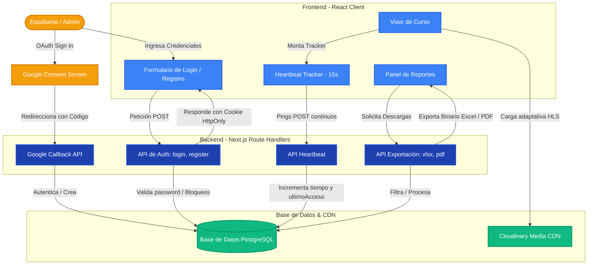

Esta página documenta la estructura de carpetas del proyecto, las tecnologías usadas y las decisiones de diseño clave de **SaberHub**.

## Diagrama de Arquitectura del Sistema

El siguiente diagrama muestra el flujo completo desde la autenticación de usuario hasta el motor de reportes y el CDN de medios:



---

## Estructura de Carpetas

```
saberhub/                          # Raíz de la aplicación Next.js
│
├── app/                           # App Router de Next.js 16
│   ├── (auth)/                    # Grupo de rutas de autenticación
│   │   ├── login/                 # Página de login
│   │   ├── registro/              # Página de registro
│   │   └── ...
│   ├── api/                       # Route Handlers (API REST)
│   │   ├── admin/                 # Endpoints de administración
│   │   ├── auth/                  # Login, registro, Google OAuth, JWT
│   │   ├── banco/                 # Banco de preguntas
│   │   ├── certificados/          # Emisión y verificación de certificados
│   │   ├── cron/                  # Tareas programadas (limpieza de tokens)
│   │   ├── cursos/                # CRUD de cursos, módulos y lecciones
│   │   ├── evaluaciones/          # Evaluaciones e intentos
│   │   ├── grupos/                # Gestión de grupos y asignaciones
│   │   ├── inscripciones/         # Alta y baja de inscripciones
│   │   ├── instituciones/         # Flujo de solicitud y aprobación
│   │   ├── intentos/              # Intentos de examen y respuestas
│   │   ├── mensajes/              # Mensajería interna
│   │   ├── notificaciones/        # Sistema de notificaciones in-app
│   │   ├── progreso/              # Progreso de lecciones + heartbeat
│   │   ├── reportes/              # Exportación a Excel y PDF
│   │   ├── sesiones/              # Videoconferencias programadas
│   │   ├── solicitudes-instructor/# Flujo de solicitud de instructor
│   │   ├── upload/                # Subida de archivos a Cloudinary
│   │   └── webhooks/              # Webhooks externos
│   │
│   ├── catalogo/                  # Página pública del catálogo de cursos
│   ├── certificados/              # Verificación pública de certificados
│   ├── CrearCursos/               # Flujo de creación de cursos (instructor)
│   ├── cursos/[slug]/             # Visor de curso con lecciones y progreso
│   ├── dashboard/                 # Panel principal (post-login)
│   │   ├── auditoria/             # Log de auditoría de acciones
│   │   ├── certificados/          # Mis certificados
│   │   ├── cursos/                # Mis cursos (instructor)
│   │   ├── cursos-externos/       # Panel de cursos externos
│   │   ├── grupos/                # Gestión de grupos
│   │   ├── instituciones/         # Administración institucional
│   │   ├── mensajes/              # Bandeja de entrada
│   │   ├── notificaciones/        # Centro de notificaciones
│   │   ├── reportes/              # Panel de reportes y exportación
│   │   ├── rutas/                 # Rutas de formación
│   │   ├── solicitud-instructor/  # Formulario de solicitud de instructor
│   │   ├── solicitudes-instructor/# Gestión de solicitudes (admin)
│   │   └── usuarios/              # Gestión de usuarios (superadmin)
│   ├── generated/                 # Cliente Prisma generado
│   │   └── prisma/                # Output del generador Prisma
│   ├── instituciones/[slug]/      # Página pública de institución
│   ├── privacidad/                # Política de privacidad
│   ├── scorm/                     # Visor SCORM embebido
│   ├── terminos/                  # Términos y condiciones
│   ├── globals.css                # Estilos globales (Tailwind v4)
│   ├── layout.tsx                 # Layout raíz (fuentes, metadatos globales)
│   └── page.tsx                   # Landing page pública de SaberHub
│
├── components/                    # Componentes React reutilizables
│   ├── AutoLogout.jsx             # Auto-cierre de sesión por inactividad
│   ├── Logout.jsx                 # Botón de cierre de sesión
│   ├── admin/                     # Componentes de panel administrativo
│   │   ├── Auditoria.jsx          # Tabla de logs de auditoría
│   │   ├── InscripcionMasivaNuevos.jsx  # Inscripción masiva de usuarios
│   │   ├── ModalDetalleInstructor.jsx   # Modal de detalle de instructor
│   │   ├── SolicitudesInstituciones.jsx # Revisión de solicitudes institucionales
│   │   └── ...
│   ├── certificados/              # Componentes de generación de certificados
│   ├── common/                    # Componentes genéricos (navbars, modales, etc.)
│   ├── cursos/                    # Componentes del visor y creador de cursos
│   ├── estudiante/                # Dashboard del estudiante
│   ├── evaluaciones/              # Motor de evaluaciones y banco de preguntas
│   ├── foro/                      # Foros de discusión por curso
│   └── sesiones/                  # Gestión de videoconferencias
│
├── lib/                           # Utilidades y servicios compartidos
│   ├── alertas.js                 # Sistema de alertas y notificaciones de negocio
│   ├── email.js                   # Plantillas y envío de emails con Nodemailer
│   ├── jwt.ts                     # Firma y verificación de tokens JWT (jose)
│   ├── notificaciones.js          # Lógica de notificaciones in-app
│   ├── password.js                # Validación de políticas de contraseña
│   ├── prisma.ts                  # Instancia singleton del cliente de Prisma
│   ├── robots-checker.ts          # Verificador de robots.txt para scraping ético
│   ├── slugify.js                 # Generación de slugs URL-friendly
│   └── webhooks.js                # Manejo y validación de webhooks
│
├── prisma/                        # Base de datos
│   ├── schema.prisma              # Esquema completo (1091 líneas, 40+ modelos)
│   ├── migrations/                # Historial de migraciones SQL
│   ├── seed-catalogo.js           # Seeder con datos iniciales de catálogo
│   └── add-slugs.js               # Script de migración de slugs
│
├── __tests__/                     # Suite de pruebas unitarias
├── scripts/                       # Scripts auxiliares (load-test k6, etc.)
├── public/                        # Assets estáticos (imágenes, favicon)
├── docs/                          # Documentación Starlight (este sitio)
│   └── src/content/docs/          # Archivos .md y .mdx de la documentación
│
├── next.config.ts                 # Configuración de Next.js
├── prisma.config.ts               # Configuración del cliente Prisma
├── tsconfig.json                  # Configuración de TypeScript
├── eslint.config.mjs              # Reglas de ESLint (next/core-web-vitals)
└── .prettierrc                    # Reglas de formateo Prettier
```

---

## Tecnologías Principales

### Framework y Runtime

| Tecnología | Versión | Rol |
|---|---|---|
| **Next.js** | `16.2.6` | Framework full-stack con App Router. Maneja SSR, SSG y Route Handlers (API). |
| **React** | `19.2.4` | Librería de UI con soporte a Server Components y hooks concurrentes. |
| **TypeScript** | `^5.9.3` | Tipado estático en toda la codebase. El cliente Prisma es 100% tipado. |
| **Node.js** | `>= 18` | Runtime de JavaScript del lado del servidor. |

### Base de Datos y ORM

| Tecnología | Versión | Rol |
|---|---|---|
| **PostgreSQL** | `>= 14` | Base de datos relacional principal con soporte a índices compuestos y enums nativos. |
| **Prisma ORM** | `^7.8.0` | ORM de nueva generación con generación de cliente tipado. Output en `app/generated/prisma`. |
| **@prisma/adapter-pg** | `^7.8.0` | Adaptador de conexión directo sin pool extra para entornos serverless. |
| **pg** | `^8.20.0` | Driver nativo de PostgreSQL para Node.js. |

### Autenticación y Seguridad

| Tecnología | Versión | Rol |
|---|---|---|
| **jose** | `^6.2.3` | Firma (`SignJWT`) y verificación (`jwtVerify`) de tokens JWT con algoritmo `HS256`. |
| **bcryptjs** | `^3.0.3` | Hash unidireccional de contraseñas con salt adaptativo. |
| **Nodemailer** | `^8.0.7` | Envío de emails transaccionales (verificación, recuperación) vía SMTP de Gmail. |

### UI y Estilos

| Tecnología | Versión | Rol |
|---|---|---|
| **Tailwind CSS** | `^4` | Framework CSS utility-first con purge en producción. |
| **@tailwindcss/postcss** | `^4` | Plugin de PostCSS para procesamiento de Tailwind. |
| **Lucide React** | `^1.16.0` | Librería de iconos SVG en formato React. |
| **@dnd-kit/core** | `^6.3.1` | Drag & Drop accesible para reordenar módulos y lecciones. |

### Exportación y Generación de Archivos

| Tecnología | Versión | Rol |
|---|---|---|
| **xlsx (SheetJS)** | `^0.18.5` | Generación de archivos Excel binarios con columnas autoajustables. |
| **pdf-lib** | `^1.17.1` | Dibujado de PDFs desde cero: banner, tablas, paginación física automática. |
| **adm-zip** | `^0.5.17` | Extracción de paquetes SCORM en formato ZIP. |
| **Puppeteer** | `^24.0.0` | Automatización Chromium para generación de PDFs de certificados vía HTML. |

### CDN y Medios

| Tecnología | Versión | Rol |
|---|---|---|
| **Cloudinary** | `^2.10.0` | CDN para subida, transformación y entrega adaptativa de imágenes y videos HLS. |

---

## Patrones de Diseño Clave

### 1. Autenticación Custom JWT (sin NextAuth)

SaberHub implementa un sistema de autenticación propio sin dependencias de terceros como NextAuth:

- **Firma**: Se usa `jose` para emitir un `JWT` firmado con `HS256` usando `JWT_SECRET`.
- **Transporte**: El token viaja en una **cookie HttpOnly** (inaccesible desde JavaScript del cliente), previniendo ataques XSS.
- **Validación**: Cada Route Handler lee y verifica la cookie en el servidor antes de procesar la solicitud.
- **Fuerza bruta**: La tabla `Usuario` tiene `intentosFallidos` y `bloqueadoHasta`. Tras 5 fallos, se bloquea la cuenta 15 minutos.

```
POST /api/auth/login
  → valida credenciales contra bcryptjs
  → verifica bloqueadoHasta
  → emite JWT con jose
  → setea cookie HttpOnly
  → retorna { ok: true }
```

### 2. Heartbeat de Conexión (sin WebSocket)

Para rastrear el tiempo activo de cada estudiante sin mantener conexiones abiertas:

```
Visor de Curso (React)
  → useEffect → setInterval(15s)
  → fetch POST /api/progreso/heartbeat
  → { cursoId }

Route Handler /api/progreso/heartbeat
  → verifica JWT
  → prisma.inscripcion.update({
      tiempoConectado: { increment: 15 },
      ultimoAcceso: new Date()
    })
```

### 3. Singleton de Prisma

Para evitar múltiples instancias del cliente en desarrollo con HMR:

```typescript
// lib/prisma.ts
const globalForPrisma = global as unknown as { prisma: PrismaClient }

export const prisma =
  globalForPrisma.prisma ||
  new PrismaClient({ adapter: new PrismaPg(pool) })

if (process.env.NODE_ENV !== 'production') globalForPrisma.prisma = prisma
```

### 4. Generación de Reportes Binarios

Los endpoints de exportación procesan las consultas de Prisma y serializan el resultado directamente a buffer binario para máxima eficiencia de memoria:

| Formato | Librería | Cabecera HTTP |
|---|---|---|
| `.xlsx` | `xlsx` (SheetJS) | `application/vnd.openxmlformats-officedocument.spreadsheetml.sheet` |
| `.pdf` | `pdf-lib` | `application/pdf` |

---

## Modelos de Base de Datos

El esquema de Prisma (`prisma/schema.prisma`) define **40+ modelos** relacionales. Los principales son:

```
Usuario          → Roles, Inscripciones, Cursos creados, Evaluaciones
Curso            → Módulos, Lecciones, Evaluaciones, Foros, Sesiones
Módulo           → Lecciones ordenadas (unique: cursoId + orden)
Leccion          → Recursos (pdf, video, audio), Progreso, SCORM
Inscripcion      → tiempoConectado, progreso, ultimoAcceso, Certificacion
Evaluacion       → Preguntas (opción múltiple, V/F, respuesta corta, desarrollo)
IntentoExamen    → RespuestasAprendiz, estado, puntaje
Certificacion    → codigoUnico, hashVerificacion, urlPdf
Institucion      → Cursos, Admin, Instructores invitados, CursosExternos
Grupo            → MiembrosGrupo, AsignacionGrupoCurso, MensajesInternos
RutaFormacion    → CursosRuta ordenados, prerrequisitos, CertificadoRuta
SesionVideoconf. → urlReunion, urlGrabacion, estado, fechaInicio
LogAuditoria     → accion, tabla, registroId, datosAntes, datosDespues
Notificacion     → tipo (8 tipos), leida, urlDestino, preferencias por usuario
```

### Enums del Sistema

| Enum | Valores |
|---|---|
| `EstadoCurso` | `borrador`, `publicado`, `archivado` |
| `EstadoInscripcion` | `activo`, `inactivo`, `finalizado`, `retirado` |
| `TipoPregunta` | `opcion_multiple`, `verdadero_falso`, `respuesta_corta`, `desarrollo` |
| `EstadoIntento` | `en_curso`, `finalizado`, `expirado`, `calificado` |
| `TipoRecurso` | `pdf`, `video`, `audio`, `imagen`, `presentacion`, `enlace`, `otro` |
| `TipoNotificacion` | `inscripcion`, `evaluacion`, `certificado`, `foro`, `mensaje`, `sistema`, `solicitud_instructor`, `sesion` |
| `EstadoSesion` | `programada`, `en_curso`, `finalizada`, `cancelada` |
| `EstadoSolicitudInstitucion` | `pendiente`, `en_revision`, `pendiente_informacion`, `aprobada`, `rechazada` |

---

## Convenciones del Código

| Aspecto | Convención |
|---|---|
| **Formateo** | Prettier: comillas simples, punto y coma, indentación 2 espacios |
| **Linting** | ESLint con `eslint-config-next` (core-web-vitals + TypeScript) |
| **Importaciones** | Alias `@/` apunta a la raíz del proyecto (`tsconfig.json`) |
| **Componentes** | PascalCase (`.jsx` / `.tsx`), organización por dominio dentro de `components/` |
| **API Routes** | Un archivo `route.ts` / `route.js` por endpoint, ubicado en `app/api/[dominio]/route.*` |
| **Prisma maps** | Todas las columnas usan `@map("snake_case")` para mantener naming SQL estándar |
| **Índices** | Todos los campos de relación (`FK`) tienen `@@index` explícito en Prisma |
