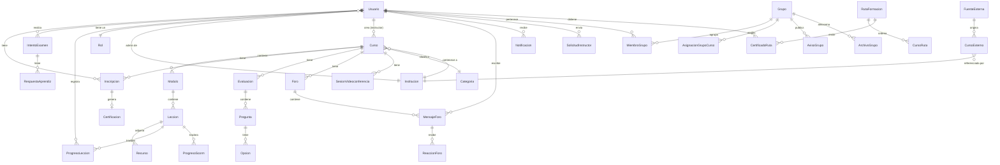

## Diagrama entidad-relación (simplificado)

---

## Modelos del sistema (47 tablas)

### Usuarios y autenticación

| Modelo | Tabla | Descripción |
|---|---|---|
| `Usuario` | `usuarios` | Usuario principal con roles, preferencias y bloqueo por intentos. |
| `Rol` | `roles` | Catálogo de roles (`admin`, `instructor`, `estudiante`, etc.). |
| `PasswordResetToken` | `password_reset_tokens` | Tokens de restablecimiento de contraseña (1 h, one-time). |
| `VerificationToken` | `verification_tokens` | Tokens de verificación de email (24 h, one-time). |
| `TokenInvitacionInstructor` | `tokens_invitacion_instructor` | Invitaciones de instructor enviadas por admins institucionales. |
| `TokenInvitacionAdmin` | `tokens_invitacion_admin` | Invitaciones de admin institucional. |
| `SolicitudInstructor` | `solicitudes_instructor` | Solicitud de un usuario para convertirse en instructor. |

### Instituciones

| Modelo | Tabla | Descripción |
|---|---|---|
| `Institucion` | `instituciones` | Entidad educativa vinculada a SaberHub. |
| `SolicitudInstitucion` | `solicitudes_institucion` | Proceso de onboarding institucional. |
| `Categoria` | `categorias` | Categorías de cursos (8 categorías en seed). |

### Cursos y contenido

| Modelo | Tabla | Descripción |
|---|---|---|
| `Curso` | `cursos` | Unidad principal de contenido educativo. |
| `Modulo` | `modulos` | Agrupación temática de lecciones. |
| `Leccion` | `lecciones` | Unidad mínima de contenido; soporta SCORM. |
| `Recurso` | `recursos` | Archivo adjunto a una lección. |
| `PrerrequisitoCurso` | `prerrequisitos_curso` | Relación self-join entre cursos. |

### Evaluaciones

| Modelo | Tabla | Descripción |
|---|---|---|
| `Evaluacion` | `evaluaciones` | Instrumento de medición del aprendizaje. |
| `Pregunta` | `preguntas` | Ítem de una evaluación (4 tipos). |
| `Opcion` | `opciones` | Opción de respuesta para opción múltiple y V/F. |
| `IntentoExamen` | `intentos_examen` | Cada vez que un estudiante inicia una evaluación. |
| `RespuestaAprendiz` | `respuestas_aprendiz` | Respuesta individual por pregunta en un intento. |

### Banco de preguntas

| Modelo | Tabla | Descripción |
|---|---|---|
| `CategoriaBanco` | `categorias_banco` | Categoría de organización del banco. |
| `PreguntaBanco` | `preguntas_banco` | Pregunta reutilizable almacenada en el banco. |
| `OpcionBanco` | `opciones_banco` | Opción de respuesta de una pregunta del banco. |

### Progreso y certificaciones

| Modelo | Tabla | Descripción |
|---|---|---|
| `Inscripcion` | `inscripciones` | Vínculo estudiante-curso con progreso y tiempo. |
| `ProgresoLeccion` | `progreso_leccion` | Flag de completitud por lección por usuario. |
| `ProgresoScorm` | `progreso_scorm` | Variables CMI del SCORM player (JSON). |
| `Certificacion` | `certificaciones` | Certificado de curso (código único + hash). |

### Grupos y rutas

| Modelo | Tabla | Descripción |
|---|---|---|
| `Grupo` | `grupos` | Cohorte o salón de clase. |
| `MiembroGrupo` | `miembros_grupo` | Membresía de usuario en grupo. |
| `AsignacionGrupoCurso` | `asignaciones_grupo_curso` | Curso asignado a un grupo. |
| `AvisoGrupo` | `avisos_grupo` | Anuncio publicado en un grupo. |
| `ArchivoGrupo` | `archivos_grupo` | Archivo compartido en un grupo (Cloudinary). |
| `RutaFormacion` | `rutas_formacion` | Secuencia ordenada de cursos. |
| `CursoRuta` | `cursos_ruta` | Posición de un curso dentro de una ruta. |
| `CertificadoRuta` | `certificados_ruta` | Certificado de completitud de ruta. |

### Comunicación

| Modelo | Tabla | Descripción |
|---|---|---|
| `Foro` | `foros` | Foro de discusión por curso. |
| `MensajeForo` | `mensajes_foro` | Mensaje con soporte de hilos, citas y moderación. |
| `ReaccionForo` | `reacciones_foro` | Reacción emoji por usuario por mensaje. |
| `MensajeInterno` | `mensajes_internos` | Mensaje directo 1:1 o grupal. |
| `MensajeInternoLectura` | `mensajes_internos_lectura` | Registro de lectura por usuario. |
| `Notificacion` | `notificaciones` | Notificación in-app. |
| `SesionVideoconferencia` | `sesiones_videoconferencia` | Sesión de clase en vivo. |

### Administración

| Modelo | Tabla | Descripción |
|---|---|---|
| `LogAuditoria` | `logs_auditoria` | Log inmutable de acciones con datos antes/después. |
| `Webhook` | `webhooks` | Suscripción a eventos con firma HMAC-SHA256. |

### Externos y scraping

| Modelo | Tabla | Descripción |
|---|---|---|
| `CursoExterno` | `cursos_externos` | Metadata de curso de plataforma externa. |
| `FuenteExterna` | `fuentes_externas` | Plataforma de origen (bloqueada/habilitada). |
| `LogScraping` | `logs_scraping` | Log de ejecución del scraper. |

---

## Enums

### `EstadoCurso`
`borrador` · `publicado` · `archivado`

### `EstadoModulo`
`activo` · `oculto`

### `TipoRecurso`
`pdf` · `video` · `audio` · `imagen` · `presentacion` · `enlace` · `otro`

### `EstadoInscripcion`
`activo` · `inactivo` · `finalizado` · `retirado`

### `TipoPregunta`
`opcion_multiple` · `verdadero_falso` · `respuesta_corta` · `desarrollo`

### `EstadoIntento`
`en_curso` · `finalizado` · `expirado` · `calificado`

### `EstadoCertificado`
`emitido` · `revocado`

### `TipoNotificacion`
`inscripcion` · `evaluacion` · `certificado` · `foro` · `mensaje` · `sistema` · `solicitud_instructor` · `sesion`

### `EstadoSesion`
`programada` · `en_curso` · `finalizada` · `cancelada`

### `EstadoSolicitud` (instructor)
`pendiente` · `en_revision` · `aprobada` · `rechazada`

### `EstadoSolicitudInstitucion`
`pendiente` · `en_revision` · `pendiente_informacion` · `aprobada` · `rechazada`
