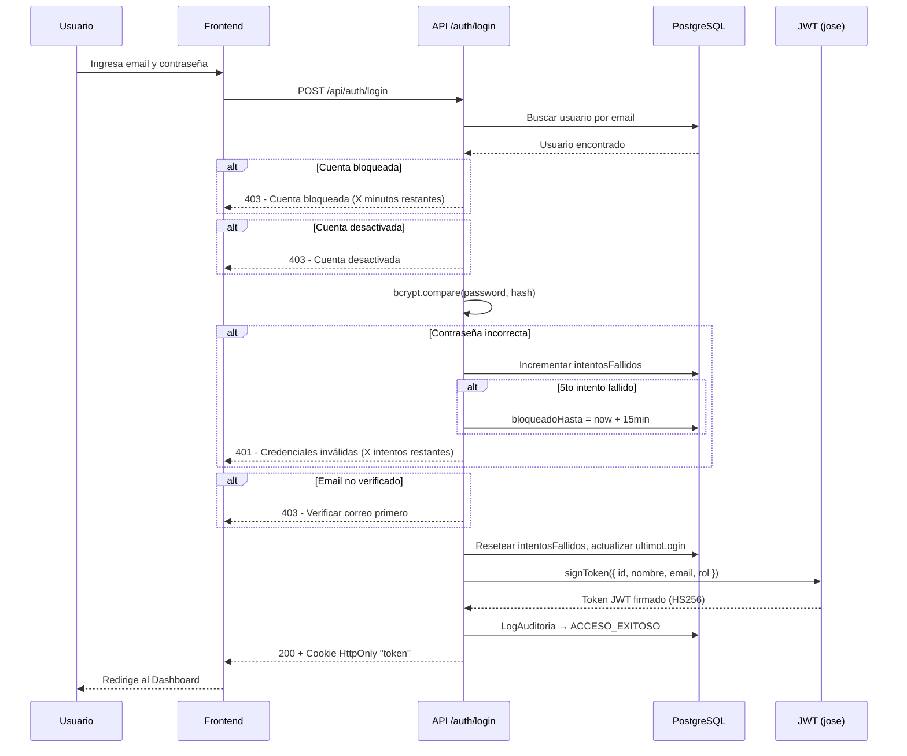
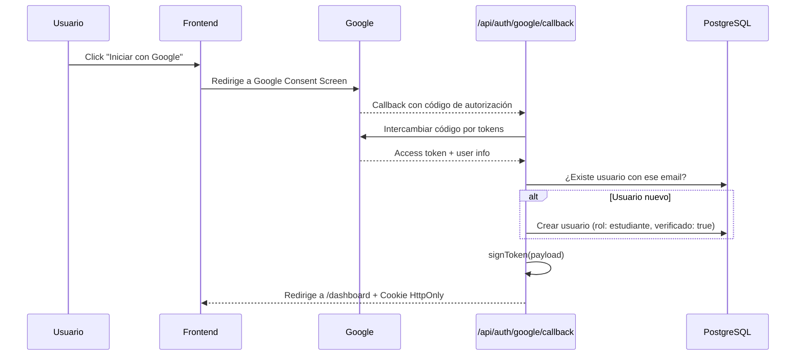

SaberHub implementa un subsistema de autenticación **completamente personalizado** sin dependencias de terceros como NextAuth. Todo se basa en JWT firmados con `jose` y cookies HttpOnly.

## Flujo General de Autenticación



## Endpoints de Autenticación

| Método | Endpoint | Descripción |
|---|---|---|
| `POST` | `/api/auth/register` | Registro de nuevo estudiante |
| `POST` | `/api/auth/login` | Inicio de sesión con email/contraseña |
| `POST` | `/api/auth/logout` | Cierre de sesión (elimina cookie) |
| `GET` | `/api/auth/me` | Obtener datos del usuario autenticado |
| `GET` | `/api/auth/google` | Inicia flujo OAuth 2.0 con Google |
| `GET` | `/api/auth/google/callback` | Callback de Google OAuth |
| `POST` | `/api/auth/forgot-password` | Solicitar enlace de recuperación |
| `POST` | `/api/auth/reset-password` | Cambiar contraseña con token |
| `GET` | `/api/auth/verify` | Verificar email con token |
| `POST` | `/api/auth/register-instructor` | Registro con token de invitación institucional |

---

## Token JWT

El sistema utiliza la librería `jose` para emitir y verificar tokens JWT:

```typescript
// lib/jwt.ts
import { SignJWT, jwtVerify } from 'jose';

const SECRET = new TextEncoder().encode(process.env.JWT_SECRET);

export async function signToken(payload) {
  return new SignJWT(payload)
    .setProtectedHeader({ alg: 'HS256' })
    .setExpirationTime('7d')
    .sign(SECRET);
}

export async function verifyToken(token) {
  const { payload } = await jwtVerify(token, SECRET);
  return payload;
}
```

### Payload del Token

El JWT contiene los siguientes claims:

| Campo | Tipo | Descripción |
|---|---|---|
| `id` | `string` | ID del usuario (CUID) |
| `nombre` | `string` | Nombre completo |
| `email` | `string` | Correo electrónico |
| `rol` | `string` | Nombre del rol (`admin`, `instructor`, `estudiante`, `admin_institucional`) |

### Transporte seguro de la cookie

```javascript
res.cookies.set('token', token, {
  httpOnly: true,      // Inaccesible desde JavaScript del cliente (previene XSS)
  secure: true,        // Solo en HTTPS en producción
  sameSite: 'lax',     // Protección CSRF básica
  path: '/',           // Disponible en toda la app
  maxAge: 1800,        // 30 minutos de sesión activa
});
```

:::note[Cookie HttpOnly vs localStorage]
A diferencia de almacenar el token en `localStorage` (vulnerable a XSS), las cookies `httpOnly` **no pueden ser leídas por JavaScript del navegador**, lo que elimina una de las superficies de ataque más comunes.
:::

---

## Protección contra Fuerza Bruta

El sistema implementa bloqueo progresivo a nivel de base de datos:

| Parámetro | Valor |
|---|---|
| **Intentos máximos** | 5 consecutivos |
| **Duración del bloqueo** | 15 minutos |
| **Campos en BD** | `intentosFallidos` (Int), `bloqueadoHasta` (DateTime?) |
| **Reset** | Login exitoso o recuperación de contraseña |

### Flujo de bloqueo

1. Cada intento fallido incrementa `intentosFallidos` en la tabla `Usuario`.
2. Al llegar al **5to intento**, se asigna `bloqueadoHasta = now + 15min`.
3. Mientras la cuenta está bloqueada, cualquier intento retorna `403` con los minutos restantes.
4. Un login exitoso resetea ambos campos a `0` y `null`.
5. Cada intento (exitoso o fallido) se registra en `LogAuditoria` con la IP del cliente.

---

## Políticas de Contraseña

La validación se aplica **tanto en frontend como en backend**:

| Regla | Expresión |
|---|---|
| Mínimo 8 caracteres | `length >= 8` |
| Al menos una mayúscula | `/[A-Z]/` |
| Al menos una minúscula | `/[a-z]/` |
| Al menos un dígito | `/\d/` |

Las contraseñas se almacenan usando `bcryptjs` con salt automático:

```javascript
const hash = await bcrypt.hash(password, 10);
```

---

## Verificación de Email

Al registrarse, la cuenta inicia con `verificado = false`:

1. Se genera un token criptográficamente aleatorio (`crypto.randomUUID()`).
2. Se almacena en la tabla `VerificationToken` con expiración de **24 horas**.
3. Se envía un email con enlace a `/api/auth/verify?token=xxx`.
4. Al hacer clic, el endpoint verifica el token, activa la cuenta y marca el token como usado.
5. Los tokens son **de un solo uso**: una vez verificado, no se puede reutilizar.

---

## Recuperación de Contraseña

1. **Solicitud**: `POST /api/auth/forgot-password` con el email del usuario.
2. **Token**: Se genera un `PasswordResetToken` con expiración de **1 hora** y se envía por email.
3. **Cambio**: `POST /api/auth/reset-password` con el token y la nueva contraseña.
4. **Seguridad**: El token se marca como `usado = true` tras canjearse (one-time token).
5. **Reset**: Se actualizan `intentosFallidos` y `bloqueadoHasta` a sus valores iniciales.

---

## Google OAuth 2.0 (SSO)

SaberHub ofrece login con Google como alternativa al registro manual:



:::tip[Usuarios de Google]
Los usuarios que se registran vía Google OAuth **se crean automáticamente** con:
- Rol: `estudiante`
- `verificado: true` (no necesitan verificar email)
- `passwordHash` vacío (solo pueden acceder vía Google)
:::

---

## Auto-Logout por Inactividad

El componente `AutoLogout.jsx` detecta inactividad del usuario:

- Monitorea eventos de mouse, teclado y scroll.
- Tras un período configurable sin actividad, cierra la sesión automáticamente.
- Redirige al usuario a la pantalla de login.

---

## Auditoría de Accesos

Cada intento de login (exitoso o fallido) se registra en la tabla `LogAuditoria`:

| Campo | Descripción |
|---|---|
| `usuarioId` | ID del usuario (null si no existe) |
| `accion` | `ACCESO_EXITOSO` o `ACCESO_FALLIDO` |
| `tabla` | `usuarios` |
| `datosAntes` | JSON con el motivo del fallo (`usuario_no_encontrado`, `contrasena_incorrecta`, `cuenta_desactivada`) |
| `datosDespues` | JSON con email y rol (en caso de éxito) |
| `ip` | Dirección IP del cliente |
